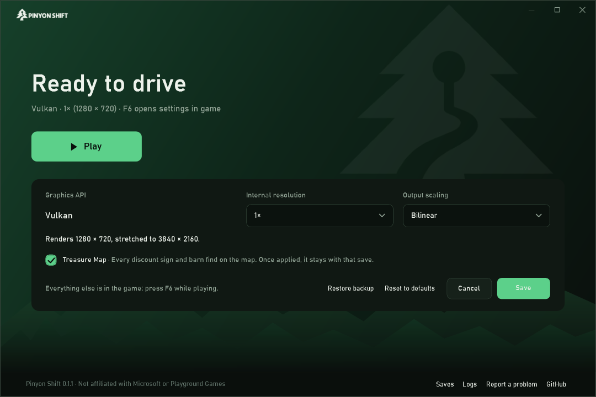

# Pinyon Shift

<p align="center">
  
</p>

<p align="center">
  <b>The Xbox 360 release of <i>Forza Horizon</i>, recompiled to run natively on Windows.</b><br>
  Built on your own PC from your own disc, with internal resolutions up to 4K.
</p>

<p align="center">
  <a href="https://github.com/arcanite24/pinyon-shift/releases/latest"><b>Download the launcher</b></a>
  ·
  <a href="#play">How to play</a>
  ·
  <a href="#roadmap">Roadmap</a>
  ·
  <a href="#supporting-the-project">Support development</a>
</p>

<p align="center">
  
</p>

Pinyon Shift is not an emulator. The game's PowerPC code is translated ahead of
time into C++ with [ShiftGlue](https://github.com/arcanite24/shiftglue-sdk), our
fork of ReXGlue, and compiled for x86-64 on your computer. The GPU command stream
the game builds is executed by a native renderer written for *Forza Horizon*,
on Vulkan, the sole supported graphics API. Direct3D 12 is legacy and unsupported.
The project is a playable preview: early,
imperfect, and surprisingly drivable.

This repository contains the launcher, build tools, host code, configuration and
the pinned ShiftGlue submodule needed to create the preview on your own
computer. It does **not** contain the game, game assets, generated translations
or a prebuilt game executable.

> **Early days.** Rendering regressions and slowdowns in some areas remain
> possible. See the [0.4.0 release notes](docs/releases/0.4.0.md) for what the
> latest release contains and its known limitations.

## Highlights

- **Native code.** The title's executable is recompiled ahead of time; nothing
  is interpreted or JIT-compiled at run time.
- **A renderer built for this game.** Every draw, clear, resolve and swap runs
  in order with the game's own shaders, translated to SPIR-V. One thread
  decodes the game's command stream while a
  second records the draws.
- **60 and 120 fps at the right game speed.** The render rate is decoupled from
  the console's 30 fps, with the simulation kept in step.
- **1x to 4x internal resolution**, FSR 1 output scaling, anisotropic and
  trilinear filtering, FXAA, and optional bloom, motion blur and depth of field.
- **Settings in game (F6)** for display, graphics, audio and controls, plus a
  trainer (F10: credits, game speed, time of day, free camera, collectibles on
  the map), photo export, save backups and [mods](docs/MODDING.md).
- **The Treasure Map included.** The add-on that showed every discount sign and
  barn find on the map was sold for Tokens through a service that no longer
  exists; it is on by default and can be turned off in the launcher.

## Performance

Measured on 2026-09-30 on one machine: AMD Ryzen 7 5800X (8 cores),
128 GB RAM, NVIDIA GeForce RTX 4080 (driver 581.08), Windows 11 Pro 26200,
3840×2160 display at 120 Hz.

### Against Xenia and the old Xenos renderer

The same scene on all four, from a new profile: the game's opening intro
cinematic and the start of the opening drive in the Viper. The internal
resolution is 1x (1280×720) and every program runs in a window at its default
settings.

| Program | Intro cinematic | Opening drive |
| --- | ---: | ---: |
| Xenia Canary (`67d80958c`, Direct3D 12) | 30.0 fps | 30.0 fps |
| Pinyon Shift 0.1.0 (ReXGlue Xenos renderer) | 28.3 fps | 29.0 fps |
| Pinyon Shift, native renderer on Direct3D 12 (legacy) | 118.7 fps | 119.5 fps |
| **Pinyon Shift, native renderer on Vulkan** | **119.8 fps** | **120.0 fps** |

On the console *Forza Horizon* runs at 30 fps, and Xenia and the Xenos-era
build keep that cap. The native renderer renders at up to the display's
refresh rate, here 120 Hz, which caps both native rows. The race below shows how
much headroom is left.

<details>
<summary>How these were measured</summary>

Each program started FH1 from a fresh profile and was driven by the same
script: A was pressed every five seconds, as the repository's
`fh1-opening-sync` route does. Xenia got the key as real input while its window
was in the foreground; the others got it posted to their window. Each target had
a warm-up run first, and the measured run started from a fresh profile again
with only the shader and pipeline caches kept.

- **Windows.** The intro cinematic is 105–165 s after launch and the opening
  drive 185–240 s, on all four (checked in window captures every 15 s).
- **Xenia and the 0.1.0 build.** Frames are counted on screen with DXGI Desktop
  Duplication, and only frames whose image changed count, since Xenia presents
  the same image several times. Averages are over one-second counts; the worst
  second was 29 fps for Xenia and 21 fps for the 0.1.0 build.
- **Native rows.** These are the game's own frame log. The same on-screen count
  gives 109.5/119.6 fps on Direct3D 12 and 116.1/118.2 fps on Vulkan, slightly
  lower because consecutive frames sometimes look alike.
- **Xenia with vsync off.** Xenia then shows about 125 distinct frames a
  second, but its emulated vblank is no longer synchronized and the game's clock
  runs fast: it reached the drive about 25 s early. Those runs are not in the
  table.

</details>

### The race, native renderer

The scripted race (`fh1-race-sync`) is the heaviest route. It is measured on
2026-10-07 at commit `e561680` over the race's frames with 5,000 draws or more
(its busiest part), with the game rate limited to 120, in a hidden window, from
the same save.

| Internal resolution | Median frame time | Median frame rate | p95 | Graphics memory |
| --- | ---: | ---: | ---: | ---: |
| 1x (1280×720), no MSAA, FSR 1 | 8.41 ms | **119 fps** | 10.75 ms | 0.9 GB |
| 2x (2560×1440), the game's 4x MSAA | 8.43 ms | **119 fps** | 11.71 ms | 3.3 GB |
| 3x (3840×2160), no MSAA | 9.82 ms | **102 fps** | 13.58 ms | 4.3 GB |

At a 60 fps limit, 2x with MSAA holds a 16.66 ms median (p95 17.04 ms). The records are
in [benchmarks/low-spec](benchmarks/low-spec). On 2026-09-30 the same race took
9.1, 12.7 and 28.7 ms at 1x, 2x and 3x, and the retired Direct3D 12 backend
12.7, 15.2 and 17.5 ms. How the Vulkan path got here is in the
[performance backlog](docs/PERFORMANCE_BACKLOG.md) and the
[desktop renderer backlog](docs/DESKTOP_RENDERER_BACKLOG.md).

### Lower-end hardware (simulated)

The **Low-spec 60** preset (1x, no MSAA, bilinear output, the game's own
texture filtering, 60 fps) on the heavy start of the race
(`fh1-race-start-wait`, about 6,200 draws a frame), with this machine limited
to fewer cores or less free VRAM. These are sensitivity numbers from one
machine: a real older CPU also has smaller caches, slower memory and lower
clocks, and the GPU here is still an RTX 4080.

<!-- Generated: tools/summarize-low-spec.py table --compact with the records in benchmarks/low-spec/2026-10-07 (all-sleep, c4t8-auto, c4t4-sleep, c4t4load-sleep, c2t4-sync-auto, c4t4load-fps40, c4t8-pressure). -->
| Configuration | Game rate | Presents a second | Median | p95 | Long frames | Decoder CPU | Recorder CPU | Title CPU | Peak VRAM |
| --- | --- | --- | --- | --- | --- | --- | --- | --- | --- |
| 16 threads (the reference machine) | 60 fps | 59.7 | 16.65 ms | 17.03 ms | 0.5 % | 7.5 ms | 7.2 ms | 4.3 ms | 1126 MB |
| 4 cores, 8 threads | 60 fps | 59.7 | 16.67 ms | 17.07 ms | 0.5 % | 8.8 ms | 8.9 ms | 5.0 ms | 1128 MB |
| 4 cores, 4 threads | 60 fps | 59.7 | 16.66 ms | 17.09 ms | 0.6 % | 7.4 ms | 7.4 ms | 4.3 ms | 1122 MB |
| 4 slow cores (SMT siblings busy) | 60 fps | 59.2 | 16.69 ms | 17.84 ms | 0.6 % | 11.1 ms | 10.6 ms | 5.8 ms | 1128 MB |
| 2 cores, 4 threads (`fh1-race-sync`) | 60 fps | 59.3 | 16.68 ms | 18.17 ms | 1.0 % | 10.2 ms | 11.2 ms | 6.0 ms | 1118 MB |
| 4 slow cores, Balanced 40 | 40 fps | 39.9 | 25.00 ms | 25.48 ms | 0.4 % | 11.4 ms | 10.8 ms | 6.5 ms | 1128 MB |
| 4 cores, 8 threads, about 1 GB of VRAM free | 60 fps | 59.6 | 16.68 ms | 17.02 ms | 0.6 % | 8.9 ms | 9.0 ms | 5.0 ms | 1130 MB |

Long frames are those over one and a half frame intervals (25 ms at 60 fps).
The CPU columns are per frame. Every row holds its rate: the CPU work of
Low-spec 60 fits 4 cores, and 2 cores with 4 threads is the edge. Four slow
cores sit at it too: eight runs gave 58.9 to 59.3 presents a second, against
59.6 to 59.7 for four ordinary cores, so they meet the 59 a second gate only
in some runs; there, Balanced 40 leaves a wide margin. The game
needs about 1.1 GB of graphics memory at 1x without MSAA (34 native surfaces
take 265 MB, textures about 150 MB) and stays there over a long drive, so a
2 GB card has room. Whether a slower GPU keeps up is not simulated: integrated
GPUs and the Steam Deck need their own runs. The records, with the commit each
ran, are in [benchmarks/low-spec](benchmarks/low-spec); the plan is in the
[low-spec backlog](docs/LOW_SPEC_BACKLOG.md).

## Play

1. Download `PinyonShift-Launcher.zip` from the latest release.
2. Extract the two files to a folder and run `PinyonShiftLauncher.exe`.
3. Drop the ISO you personally dumped from a supported original disc onto the
   launcher, or choose it with **Choose ISO**. You can also use **Choose extracted
   folder** for an unmodified, complete dump of the supported disc; see
   [extracted game inputs](docs/EXTRACTED_GAME_INPUT.md).
4. Confirm ownership, then choose **Verify and build**.
5. Leave the launcher open while it installs the Windows build tools and builds
   the preview. The first build can take 20–60 minutes and needs roughly 25 GB of
   free disk space.
6. Choose **Play**. Press **F6** in game for settings.

<p align="center">
  
</p>

**Settings** in the launcher shows Vulkan and picks the internal resolution
and the output scaling (bilinear, CAS or
FSR 1), and says what that means on your screen: for example, renders
1280 × 720, FSR 1 upscales to 3840 × 2160. The Treasure Map toggle is there
too: on by default, and once a save's map is revealed it stays revealed, as
after a purchase. **This PC** lists the graphics card, its memory and Vulkan
version, the CPU's cores and the display's refresh rate, recommends the
in-game preset that suits them (the same rule a new install uses, and
Balanced 40 below 4 CPU cores) and sets it with one click. It warns when no
Vulkan 1.3 driver is found. Existing Direct3D 12 settings migrate to Vulkan on the next
start. Everything else, including the **Low-spec 60**, **Balanced 40**,
**Performance 120** and **Quality 60** presets, is in the in-game settings, where
most changes apply at once; MSAA and the language are among the few that need a
restart. A new install starts at Low-spec 60, or at Performance 120 on a
discrete GPU with 6 GB or more, 6 or more CPU threads and a 120 Hz display.

To change the game language, press **F6** at the title screen or during play,
open **Profile → Language**, and use Left/Right to choose a language and region.
Close and restart the game to apply it. This is available before the first race;
the choice stays saved for the next launch.

The preview launcher is not code-signed yet, so Windows may identify it as an
unrecognized app. Use only the archive attached to this repository's release
and verify its published SHA-256.

The launcher verifies the image before reading it. Unsupported or modified
images are rejected. Your image and extracted game files stay on your machine.
The launcher downloads build tools and the pinned ShiftGlue source, extracts
the disc locally, generates the translation locally and compiles the executable
locally. Administrator permission is requested only if compatible Visual Studio
Build Tools must be installed. VS 2022 Build Tools 17.1 or newer are required;
VS 2019 alone does not satisfy the C++ standard library requirement.

To build on another drive, choose **Change** next to **Installs to** on the
setup screen of the packaged launcher. The launcher remembers your choice for subsequent launches.
This selects an installation; it does not move an existing installation or save.
You can also override the remembered location from PowerShell:

```powershell
$env:PINYON_SHIFT_INSTALL_ROOT = 'D:\Games\PinyonShift'
.\PinyonShiftLauncher.exe
```

Source, downloaded tools, extracted game data and the default save and cache
tree live beneath that folder. Existing installations and saves are not moved;
an existing `PINYON_SHIFT_STATE_ROOT` override still takes precedence for saves
and caches. Launchers inside a repository checkout continue to use that
checkout. This is a custom build location, not a portable install: the choice
is remembered in `%LOCALAPPDATA%\PinyonShift\install-root.txt`, and Microsoft
Build Tools still need system-drive space.

If setup fails, the launcher shows which step failed, its exit code, the first
real compiler, CMake or file-copy error from that step's log and a hint for
common causes (a full disk, low memory, antivirus, a file in use). The same
report is saved in `.local/logs/setup-error.json`, next to the complete logs.
Include that report when filing an issue; the final "build failed" line alone
cannot identify the cause.

### Portable install

To keep everything in one folder you can move or carry, put an empty file named
`portable.txt` next to `PinyonShiftLauncher.exe` (or start the launcher with
`--portable` for a single run). The launcher then keeps the release source,
downloaded build tools, the build, logs, crash reports, saves, settings,
photos, save backups and shader caches in a `data` folder beside itself, and
the setup screen reads **Portable:** followed by that folder:

```text
PinyonShift\
  PinyonShiftLauncher.exe
  pinyon-shift-source.zip
  portable.txt
  data\source\<version>\                  release source, tools, build, setup logs
  data\source\<version>\.local\preview\   saves, settings, game logs, crash reports
  data\temp\                              temporary files of setup and crash reports
```

Nothing is written to `%LOCALAPPDATA%\PinyonShift` or the registry, and
`PINYON_SHIFT_INSTALL_ROOT` and `PINYON_SHIFT_STATE_ROOT` are ignored. No
absolute path is stored: the launcher finds every location from its own folder
at each start, so the whole folder can move to another drive or Windows PC. A
build moved this way plays as it is; the next rebuild (after an update)
configures the moved build folder afresh and recompiles.

Extract a portable install into a folder you can write to, such as
`D:\Games\PinyonShift`: the launcher refuses read-only locations like Program
Files with an explanation. Keep the path short, too: the build creates files
about 185 characters below `data`, so the launcher will not start a build when
the `data` folder's path is longer than 70 characters. Outside the launcher's
control are Visual Studio Build Tools (a system install, added again on another
PC at its next build), the graphics driver's own shader cache, and the files
.NET unpacks from the launcher into `%TEMP%\.net` when it starts (set
`DOTNET_BUNDLE_EXTRACT_BASE_DIR` to a folder of your choice to move them too).

### Requirements

- The USA retail base disc, serial `MS-2505`, title ID `4D5309C9`.
- Windows 10 or 11, x64.
- A GPU with Vulkan 1.3. Only NVIDIA GPUs are
  qualified so far; AMD and Intel are untested. Low-spec 60 uses about
  1.1 GB of graphics memory.
- A CPU with 4 cores for Low-spec 60, by the
  [simulated runs](#lower-end-hardware-simulated); 2 cores with 4 threads is
  the edge. Slower GPUs, integrated graphics and the Steam Deck are not
  measured yet.

This is a public preview, not a finished remaster. Please report reproducible
problems with the issue template and do not attach game files or generated
code.

## Reporting crashes and bugs

Keep the launcher open while playing. If the game exits unexpectedly, the
launcher catches the exit, creates a sanitized diagnostic ZIP, and offers one
button to open a prefilled GitHub issue with that ZIP selected in Explorer.
Attach the selected ZIP and add the shortest reliable reproduction steps.

The public report includes build hashes, a stable crash ID, exception details,
the end of the runtime log, runtime settings, Windows build, CPU, GPU and driver
versions. It excludes the game, saves, generated code, input capture, local
paths and memory dumps. A fuller dump stays on the player's computer and should
only be shared privately if a maintainer requests it. Non-crash bugs can be
reported with **Report a problem** in the launcher.

## Build from source

From a PowerShell terminal in a repository checkout:

```powershell
.\tools\setup-preview.ps1 -IsoPath C:\path\to\your-disc.iso
.\tools\launch-preview.ps1
```

The setup script provisions pinned dependencies, initializes ShiftGlue,
verifies and extracts the disc, generates translated source, and builds Release
with Vulkan as the supported graphics API. The retained Direct3D 12 code is legacy.
`python tools/pinyon.py launch` starts the built game the same way without
PowerShell, with `--state-root`, `--hidden` and game arguments after `--`; it is
the launcher for Linux builds. See [Building](docs/BUILDING.md) and
[Troubleshooting](docs/TROUBLESHOOTING.md) for details.

## Roadmap

Public priorities, updated 2026-10-04 from community feedback and the current
development work. Gameplay-blocking bugs and save safety take priority within
each phase. These are priorities, not release dates; ports need validation on
their target hardware before they are ready for players.

The [community request review](docs/ROADMAP_FEEDBACK.md) explains the demand and
the proposed additions. The [feature backlog](docs/FEATURE_BACKLOG.md) is the
central list of player-facing features. Implementation details and acceptance
gates are in the
[native port backlog](docs/NATIVE_PORT_BACKLOG.md),
[performance backlog](docs/PERFORMANCE_BACKLOG.md) and
[Android port backlog](docs/ANDROID_PORT_BACKLOG.md).

Done since 0.1:

- [x] Change resolution and render scale while the game is running
- [x] Apply graphics settings without restarting the preview
- [x] Support ultrawide (21:9 and wider) displays, with a 16:9 HUD and a field
  of view setting
- [x] Ship a modding API for loading custom content: native plugins, file and
  archive overrides, database patches and texture replacement
- [x] Let mods add HUD labels, menu actions and replacement text
- [x] Play in any of the disc's 18 languages
- [x] Achievements, photo export, save backups and a trainer in game
- [x] Support portable installs
- [x] Keep crowd and purchase animations at the right speed above 30 fps
- [x] Initial Android runtime and local APK build from the launcher
  ([developer alpha](docs/ANDROID.md))

In progress:

- [ ] Native Linux support
- [ ] FH1 v4 title-update support, built from your USA disc and your own
  update ([title update v4 backlog](docs/TITLE_UPDATE_V4_BACKLOG.md))
- [ ] DLC support from your own Xbox 360 content, including car packs and
  the Horizon Rally expansion
- [ ] Easier Android build, USB installation and game-data transfer

### DLC support priorities

The immediate priority is Rally's original discovery, event entry, menus and
progression. Starting championships through F6 is a development shortcut;
restoring the intended in-game experience remains open in the
[DLC backlog](docs/DLC_BACKLOG.md#immediate-priority-the-original-rally-experience).

Planned support from your own Xbox 360 content, ordered by gameplay value.
Package availability does not mean it is playable yet. DLC currently runs on
the supported base disc. The original Rally and 1000 Club code exists only in
v4, so those expansions are moving to a v4 build made from the same disc
([title update v4 backlog](docs/TITLE_UPDATE_V4_BACKLOG.md)). The launcher imports verified owned
packages and keeps them disabled until enabled individually; full gameplay support
is still being qualified.
Enabling Rally also prepares its owned assets against the supported base disc.
Prepared stages use each championship's correct class target and the base game's
class restriction. Requiring Rally upgrades in car selection is still pending.
Preparation also binds the owned Rally ticket images through the base UI's
supported texture folders. The original Rally menu layout remains unfinished.
Prepared championship and stage names now follow the owned route order;
older prepared caches rebuild automatically without changing saves.
Normal launch verifies and mounts the generated Rally entry assets. They include
seven owned activation locations, localized stage names and a director that
preserves unfinished attempts. Physical entry at these coordinates and full Rally gameplay
remain unqualified.
An optional developer preparation mode (`tools/prepare-fh1-rally.py --native-menu`)
generates the seven-ticket native hub and car-selection flow. Its activity
context, championship focus, car-selection cancellation and gameplay return
pass component tests; physical entry, prizes and Rally upgrade eligibility
remain unfinished. New installations keep the existing development flow.
Launch preflight preserves an explicitly selected mode; `--no-native-menu`
switches it off again. See the [DLC backlog](docs/DLC_BACKLOG.md).
The development in-game menu (F6) now includes **Horizon Rally** with championship
selection, resume status and retirement confirmation. Keyboard selection of
championship 7 passes a native Vulkan first-stage entry and initial-checkpoint
test from a normal owned-content save. Keyboard resume of stages 1 and 2 and
confirmed retirement also pass for that championship, preserving earned records.
Full championships, other input methods and the remaining Rally gameplay checks
are still being qualified.
Those menu/progression probes used a profile-only test fixture; full-save
qualification with the existing saved garage is still pending.
The normal title database merge also passes a read-only Vulkan check of all
16 Rally car rows and their tyre, suspension and engine option counts. The
imported licence covers five selectable cars; the Focus SVT remains unowned.
The owned Escort RS Cosworth now passes normal Autoshow purchase, garage save,
fresh reload and free-roam driving on Vulkan with the complete pinned save.
Its Custom Upgrade menu opens after reload. Rally tyre, suspension and transmission
purchase, save and reload pass, followed by normal stage-two resume and initial
driving with all three parts installed. Preparation also adds Rally tyre options
for 173 base-car entries; an owned Mustang passes normal tyre purchase, save,
reload and initial Rally driving. Base-car suspension/transmission conversions,
Rally surface handling and tuning, other Rally cars and disabling Rally with a
purchased Rally car's upgrades remain unqualified. Disabling Rally with the stock
Escort selected, saving a base-car switch, then restoring and driving the same
Escort passes with all seven garage cars and purchased parts retained.
Disabling Rally with a saved Rally tyre now stops with a recovery message and
preserves the purchased part. Re-enabling Rally restores the tested Mustang's
load and initial driving; other missing DLC cars and parts still need checks.
Rally selection now stays disabled while a native garage/service flow owns
game control. A Vulkan garage check rejects selection there, then resumes the
saved stage after leaving the garage; other services still need qualification.
A diagnostic native-AI run finishes stages two and three with the complete
saved garage, preserves their earned checkpoints and reloads stage three
through F6 on Vulkan. Both finish backgrounds now render the road and terrain
correctly after grounding their camera targets. Manual full-stage driving and
other finish views remain unqualified.
An earned championship-7 completion also passes a fresh Vulkan reload with
all seven garage cars, 122 purchased parts and four stage times preserved,
followed by an 85-metre drive and map return without diagnostic AI.
The DLC panel reports cached assets separately from gameplay support; normal
Rally entry and progression are still being qualified and ported.
The [DLC backlog](docs/DLC_BACKLOG.md) tracks dependencies and acceptance checks.
Monthly car packs share a priority and are listed in release order.
Current DLC qualification targets Vulkan only. Direct3D 12 results below were
recorded before its legacy designation and remain historical evidence.
Private Rally probes finish solo stages on Vulkan and D3D12 using the base
disc. A private native stage record now saves completions and best times and
reloads them beside the active profile. A private two-stage probe also loads
the next Rally route on both renderers. The private four-stage director now
finishes series 7 and saves its total on both renderers. Both also resume an
incomplete attempt and reload a completed record unchanged. Fresh full-series
checks on both renderers preserve the original return position, reload Colorado
and drive after the final results. Base-native English and Spanish pace-note
probes start a cue and capture non-silent game audio. Private route-1 tests
also sequence 10 authored phrases in English on Vulkan and Spanish on D3D12
through the base audio interface. A private owned-icon HUD now draws the
current phrase's turns, and active-phrase pause/resume checks pass on English
Vulkan and Spanish D3D12. Native restart checks on both also re-arm the first
phrase, continue to later calls and save a subsequent finish. Visual HUD review,
speech intelligibility, live rewind and complete authored pace-note coverage
remain open. Results-screen replay saves a second completion on both renderers
and preserves the faster best. Fresh native reloads retain both completions
and the best time unchanged while starting another stage.
A private built-in overlay also finishes route 1 and saves its stage record
and series checkpoint in the normal profile on both renderers, with no mods
enabled. Fresh processes resume stage 2 and preserve the earned record.
The experiment still uses a temporary entry prompt and base race UI.
The owned co-driver now activates without a pace override and selects its bank
from the console language and country. Fresh English and Mexican Spanish
Vulkan checks each play 10 complete phrases in that private entry fixture.
Official entry, Rally scoring, XP, wristbands, unlocks and the remaining gameplay qualification
remain open.

- [x] Treasure Map functionality, already included in the preview
- [x] Launcher DLC import, detection and enable/disable controls (Windows
  development build; verified local catalog, release integration and gameplay
  qualification pending)
Car packs are qualified with every owned package enabled together (on the
optional v4 build, and spot-checked on the default build): each pack's cars are owned in the game's own entitlement
cache and show in the Autoshow, and one car per pack was bought, reloaded from
a fresh launch and driven. Import every copy of a package you own: verified
variants of the same package combine their licences (the full November pack
needs its full-licence copy).

- [x] Horizon Rally Expansion Pack: native entry, intro, hub, car selection and
  a championship on the v4 build (other championships not yet played)
- [x] 1000 Club Expansion Pack: offline car challenges with saved medals on the
  v4 build ("1000 Club offline" in the launcher)
- [x] October Car Pack
- [x] November Bondurant Car Pack
- [x] December IGN Car Pack
- [x] January Recaro Car Pack
- [x] February Jalopnik Car Pack
- [x] March Meguiar's Car Pack
- [x] April TopGear Car Pack
- [x] VIP Membership & Cars Pack: cars, plus Fast Travel Anywhere on v4
- [x] Honda Challenge Car Pack (cars; the challenge flow is unqualified)
- [x] Pre-Order Car Pack
- [x] Season Pass: 2006 Lamborghini Miura Concept
- [x] 2013 Ford Shelby GT500 - Rockstar Energy
- [x] Individual promotional cars: Nissan 370Z, Ferrari 458 Italia,
  Mercedes-Benz SLS AMG, Volkswagen Golf R and Aston Martin Virage (they share
  the Pre-Order cars without duplicates)
- [x] LCE: Day1 DLC Pack, including its custom-painted cars (shares the
  October roster)

Next, in priority order:

- [ ] Fix remaining crashes, loading failures, rendering regressions and
  recurring stutter, including intro, showcase and free-roam transitions
- [ ] Make setup more reliable and the first build faster; validate the
  toolchain before building and recover from interrupted setup
- [ ] Qualify AMD and Intel GPUs and publish tested hardware, drivers,
  settings and performance results
- [ ] Expose FSR 1 quality presets and sharpening controls in settings,
  with the rendered and output resolutions shown clearly
- [ ] Validate Steam Deck and SteamOS: controls, Steam Input, suspend and
  resume, and performance presets
- [ ] Improve sustained Android frame pacing and thermals on supported
  devices; measure long sessions as well as startup performance
- [ ] Update from inside the launcher while preserving saves and settings
- [ ] Safely import saves from Xenia and Xbox 360, and transfer profiles
  between supported platforms
- [ ] Support more disc regions

Mid term, in priority order:

- [ ] Let the trainer toggle AI driving for the player's own car, with an
  immediate return to manual control
- [ ] Reuse player-car AI driving in automated gameplay and performance tests
  from pinned save seeds, with route checks and captured diagnostics
- [ ] Improve asset streaming and multi-core utilisation; replace measured
  bottlenecks and fixed limits inherited from Xbox 360 hardware
- [ ] Shorten loading screens and remove avoidable loading transitions through
  background streaming; speed up saves while preserving atomic writes and backups
- [ ] Better Android performance on lower-end hardware, with published
  device requirements and sustainable graphics presets
- [ ] Nintendo Switch support, starting with hardware feasibility and
  performance validation
- [ ] macOS support through MoltenVK
- [ ] Racing wheel, pedal and force feedback support
- [ ] Install, enable and order mods from the launcher, with compatibility
  guidance for existing FH1 mods
- [ ] Custom radio stations and music replacement from local files
- [ ] Verify DualSense and variable refresh rate displays
- [ ] Sign the launcher and preview executables

Longer term and research:

- [ ] Hold 120 fps in every race, and pursue 4K at 120 fps on qualified hardware
- [ ] More trainer options: unlock cars and events, and let any car enter any
  event
- [ ] Let mods add items to the game's own menus
- [ ] Import cars from *Forza Horizon 2*
- [ ] Research importing cars from *Assetto Corsa*, including geometry,
  materials, physics and FH1 integration for compatible, permitted content
- [ ] Investigate multiplayer restoration, starting with LAN feasibility

Other *Forza* recompilations would be separate projects; stabilising FH1
comes first.

Measured findings and validation rules are in
[development findings and priorities](docs/DEVELOPMENT.md).

## Project boundaries

Only independently authored project files are licensed under the
[BSD 3-Clause License](LICENSE). Microsoft, Xbox, Turn 10 Studios, Playground
Games, *Forza Horizon*, and third-party dependencies remain the property of
their respective owners. Pinyon Shift is not affiliated with or endorsed by
them. See [Legal and distribution](docs/LEGAL.md) and
[Third-party notices](THIRD_PARTY_NOTICES.md).

## Contributing

Start with [CONTRIBUTING.md](CONTRIBUTING.md). Repository checks reject disc
images, executables, generated translations, extracted assets, build products,
and other machine-local material.

## Supporting the project

Pinyon Shift is and will remain free. Every release, feature and setting is
public on the same day for everyone. There are no supporter builds, early
access, paid features or paid mods, and there never will be.

If you would like to support continued development, you can
[sponsor arcanite24 on GitHub] or [buy me a coffee on Ko-fi]. Contributions
pay for development time and for test hardware, such as Android phones and
lower-end GPUs used for the performance work. They do not buy builds, game
content, priority support or influence over the roadmap. Support is for the
work on this project, not for *Forza Horizon*, which remains the property of
its owners.

Sharing the project, reporting bugs with a diagnostic ZIP and contributing
code help just as much.

[sponsor arcanite24 on GitHub]: https://github.com/sponsors/arcanite24
[buy me a coffee on Ko-fi]: https://ko-fi.com/nerijs
