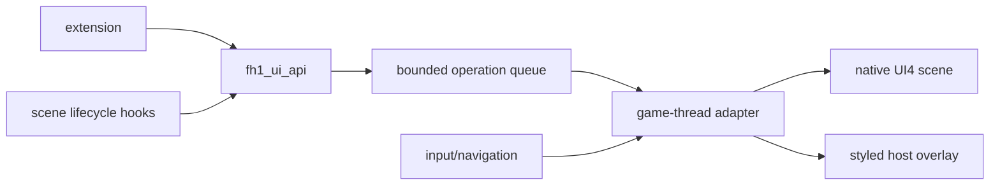

# FH1 UI API foundation

Status: API and research foundation implemented. A default-off native pause-row
prototype passes focus, activation, cancellation and close/reopen checks.
Production callbacks and original Rally entry are still unfinished.
Three fresh-copy lifecycle runs and repeated activation within one process pass.
Native pause-button and owner/model cleanup also pass over three closes.
The production adapter and original Rally entry remain unfinished.
The private `AddMenuItem` bridge now applies an owned HORIZON RALLY caption and
tracks three native scene generations; its action remains diagnostic Difficulty.

## Outcome

The first public API is `pinyon_shift::ui::Api` in
`src/ui/fh1_ui_api.{h,cpp}`. It gives extensions stable scene handles and a
bounded operation queue instead of exposing guest addresses, PPC registers,
or UI4 record layouts.

The supported operations are:

- `SceneReady` and `SceneClosing` for lifecycle ownership.
- `SetText` and `SetVisible` for existing components.
- `AddMenuItem` and `RemoveComponent` for extension-owned controls.
- `Drain` for the game-thread adapter.

Handles carry a generation. Closing or replacing a scene invalidates old
handles and removes their queued work. Component IDs are unique within an
active scene. Inputs and queue size are bounded. The API is independent of the
rendering backend so callers can use the same operations for a native UI4
adapter or a host overlay.

Native session `20261006T151006Z-p37884` reuses the pause owner's address after
closing and reopening it. An address alone cannot distinguish scene lifetimes;
the production adapter must advance the generation at the native open boundary.

## Architecture



The game thread owns all guest UI changes. Extensions only enqueue operations.
The adapter resolves semantic IDs such as `pause.menu.multiplayer`; guest
addresses stay private and are rediscovered for each scene generation.

Native UI4 is the preferred backend because it preserves the title's fonts,
animation, localization, focus, sounds, and controller behavior. A host
overlay is appropriate for new HUD widgets while native construction is still
being qualified. Its theme must be sampled from the active scene rather than
invented by each extension.

## Proven behavior

The repository contains two separate proofs:

1. Existing-screen modification is proven by the default-off `label_patch`
   experiment. It changes the pause-menu `MULTIPLAYER` label to `PINYONSHIFT`
   inside the title's LSB2 string-table route. The stock UI continues to own
   layout, font, focus, animation, and rendering.
2. The API contract is covered by `pinyon_shift_fh1_ui_api_tests`: lifecycle,
   stale handles, duplicate IDs, removal, and queue capacity.

Native insertion research reached a precise boundary. The
strict encoder in `tools/fh1-ui-scene-insert.py` round-trips the stock
`925_PAUSE_MENU.bgf` byte-for-byte and produces an eighth row whose BGF counts
and bounds pass structural checks. This does not construct the native objects
in the companion FBF. It updates item, property, relation, relationship-child, identity, style,
track, animation, key, and declared-byte counts together. The runtime stream
adapter serves the longer member past the stock end-of-file.

The title constructs eight `CPauseMenuButton` instances. Cloning the Message
Center row still fails in `sub_8281BBA8` while initializing the duplicated
control's scaler bindings. The initial encoder treated item values, the row's
72 property strings and shared action strings as string-identity domains.
Companion-file inspection below corrects that assumption: item values also
reference native objects. Cloning strings alone leaves missing native owners.
Eight instances being constructed does not qualify focus or navigation capacity.
Broad pointer or RTTI guards would only hide the invalid graph. Keep the experiment default-off
until the acceptance test below passes.

The 2026-10-06 Rally pause-entry investigation also found that subtree insertion
relocated item and relationship indexes but left later items' existing companion
owners unchanged. The encoder now relocates those style, track and animation
references while cloning from the original records. A synthetic graph regression
checks both relocation and unchanged clone sources; the stock scene still
round-trips byte-for-byte. This fixes an encoder defect, but does not qualify
native insertion: private session `20261006T095550Z-p20960` recognized and served
the inserted pause member, then failed in scaler initialization with null/raw
binding values. The eighth-row acceptance gate remains open. Evidence is retained
under ignored `D:/horizon1-recomp-tests/rally-pause-relocation-20261006/`.

Earlier evidence is in runtime logs `20260921T003312Z-p23120.jsonl` and
`20260921T003420Z-p38220.jsonl`. The first reaches cloned scaler bindings whose
values are raw identity indexes; the second proves that remapping every known
identity domain still leaves the cloned owner without registered bindings.

The subsequent 2026-10-06 encoder revision permits any of the seven row
templates and remaps copied track/animation string keys using the native
type-20 predicate, including its independent flag bit. Numeric key values
remain literal. Both synthetic regressions pass; all seven real templates
pass encoded item/identity/relation bounds and count checks. These are
structural checks, not gameplay qualification. The string-key revision leaves
the Message Center payload byte-identical, so it does not explain its crash.

A bounded, read-only resolver probe at `82E72E68` / `82E73008`, enabled only
for scripted scene-insertion experiments, distinguishes missing paths from
missing live objects. Session `20261006T101238Z-p21756` resolves the Message
Center clone's paths, but their values contain ASCII bytes instead of live
object pointers; scaler initialization still fails. Cloning the first row
instead, session `20261006T101446Z-p18232`, passes scaler initialization and
captures free roam at frame 4200. Opening pause at frame 4300 then fails in
`sub_82E62A10`: a kind-5 node named `137ED5BA` has a null binding. Its source
node was initially described as the `contract` expression; companion-file
inspection below disproves that interpretation. No pause-open or eighth-row
activation capture passed. Receipts are under
ignored `D:/horizon1-recomp-tests/rally-pause-bindings-20261006/`.
The pinned seed profile hash is unchanged; both runs used private state copies.

The next companion-file investigation identifies a concrete missing-object
contract. The stock pause scene has BGF, BSG and FBF members. The FBF reader
`82E6E1D8` consumes version 1008 followed by 501 native objects; 1008 is not
an object capacity. BGF native-reference kinds 1, 4, 5, 6 and 7 resolve their
values through this object-ID table, independently of BGF string indexes.
Stock BGF has zero missing FBF IDs; the first-row subtree clone has 36.
In particular, stock ID 28 is FBF type 5, `Material1583`, rather than the
unrelated BGF string 28 (`contract`). Mapping it to a new string index does
not create a new material. First-row BGF property values 24/25 are font/caption
strings; the type-4 FBF geometry index is a separate numeric field and remains
literal. Interpret fields through their native readers rather than remapping
every coincident number as a string.

`tools/fh1-ui-fbf.py` now strictly parses the retail pause records and geometry
trailer and checks these cross-file references with `--bgf`. Three regressions
cover ID-domain separation, duplicate/truncated records and trailer bounds.
The stock file consumes exactly 139862 bytes: 501 unique objects, 106 geometry
records, 3816 extra geometry bytes and 71232 GPU bytes. This is read-only
validation. The same tool accepts
`--bsg`: native readers `82F27210` through `82F279C8` consume a 32-byte
header, 241 packed 96-byte nodes with parent indexes, then 260 five-byte pool
records. The entire stock BSG consumes exactly 24488 bytes. A fourth regression
checks parent availability and separate pool bounds. Native material/texture
ownership and coordinated BSG cloning required the following revision before
insertion can be qualified. A later first-row run (`20261006T105003Z-p36140`) crashes before
the previous free-roam checkpoint, so the earlier scaler pass is not repeatable
qualification. Keep insertion default-off and create independent native
objects rather than sharing live source pointers or suppressing tree walks.
The cross-file receipt is
`D:/horizon1-recomp-tests/rally-pause-companions-20261006/validation.json`.

The coordinated encoder now accepts `--clone-row` with all three companions.
It allocates native IDs 764 through 799 independently of the 72 copied BGF
string slots, updates material and texture owners, and copies 15 BSG nodes
plus 21 material/texture pool records. Internal node parents move to their
clones; the new row root keeps its existing external group. The FBF geometry
and GPU tail remains byte-identical, while native material instances are
independent. Five companion regressions and two BGF regressions pass; all
seven real row templates have matching 537-object FBF/BSG tables and zero
missing BGF native objects. These are encoding checks, not gameplay proof.

For owned extracted inputs, the research command is:

```powershell
python tools/fh1-ui-fbf.py <pause.fbf> --bgf <925_PAUSE_MENU.bgf> `
  --bsg <pause.bsg> --clone-row 0 --output-dir <new-directory>
```

The command refuses existing output files. A private-game test with the
coordinated members in a rebuilt UI archive timed out before its first frame;
both the stock-game control and the private-game control with the original
archive completed. Archive delivery must be qualified before the clone's
native behavior can be assessed. No pointer repair experiment was enabled in
these runs. Encoding and runtime evidence is retained under
`D:/horizon1-recomp-tests/rally-native-companion-clone-20261006/`.

Subsequent controls narrow delivery further. Rebuilding UI without replacements
works; replacing byte-identical stock members with either stored ZIP data or
literal LZX/XMem blocks stalls before rendering. The host extractor decodes
the LZX blocks exactly (including odd tails and E8 bytes), but native delivery
is unqualified. Loose companions are ignored and still produce seven buttons.
The new, script-only `scene_companions` memory-stream experiment at `82C7E0B0`
matches complete original decoded bytes and replaces only FBF in session
`20261006T113027Z-p35900`. BGF and BSG use another reader path. That partial
run reaches free roam but crashes when pause opens, with crash ID
`pscrash-v1-89312dc6fcffd69b418f`; it is not eight-row qualification. The next
step is coordinated delivery at the BGF/BSG reader boundaries, followed by the
same native acceptance gate. The old `scene_insert` pointer repairs are disabled
in this separate mode. `qualification.json` records the controls, failure and
unchanged original UI/pinned-save hashes. No AppData-backed run was used.
The latest desktop build also passes a normal-mode boot control
(`20261006T113524Z-p31244`): game mode 17, valid vehicle pose, one capture,
completion at frame 1800, and no companion substitutions. This verifies the
default-off behavior at boot, not the native eight-row acceptance gate.

The next reader investigation identifies `82E614C8` as the UI4 `fread`
callback. Its cursor points to a holder, then the decoded resource; the
resource's buffer and length are at +112/+116. A script-only hook immediately
before its copy at `82E614FC` now serves BGF and BSG replacements, with exact
whole-member matching and bounded per-cursor caching. The memory-stream hook
continues to serve FBF. Source resources and their ownership stay intact.
Session `20261006T114758Z-p26396` substitutes byte-identical originals through
all three readers and completes its four-capture script. Visual inspection
shows its nominal pause capture still on a loading screen, so that control
proves delivery and script completion only, not pause navigation.

Coordinated clone sessions initially crash before free roam, despite creating
eight buttons. Session `20261006T115342Z-p9032` faults at native cast
`823E4818`, reading cloned geometry ID 779 as a pointer; additional probes
also expose initialization corruption. The concrete encoder defect is the
packed BGF maximum native object ID at offset `0x1B`: it remains 763 although
the copies use IDs 764..799. Header reader `82F260C8` stores that ceiling via
`82DB7BC0`; `82F248F0` allocates the scene lookup and binding tables for
ceiling + 1 entries. The coordinated encoder now raises this word to cover
every cloned ID. A synthetic full-scene regression checks both expansion and
preservation of an already larger ceiling; all seven retail templates still
pass cross-file checks.

Corrected session `20261006T120914Z-p21804` substitutes all three companions,
creates eight native buttons, resolves cloned scaler paths to live pointers,
captures free roam and an open pause menu, completes at frame 5460 with four
captures, and exits normally. The images still show seven visible rows:
the nominal eighth-focus capture selects Quit, and activation opens the stock
Quit confirmation. This qualifies initialization and first pause open for
the private clone, **not** eighth-row visibility, focus, activation or Rally
entry. Controller registration/navigation remains the next acceptance gate.
The experiment stays default-off; no production Rally entry claim follows.
Latest normal-mode control `20261006T121144Z-p30512` also reaches visually
verified free roam (mode 17, valid pose), completes at frame 4260 and exits
normally with no companion substitutions. Original UI and pinned profile
hashes remain unchanged. The receipt retains both earlier crashes and the
corrected captures; eight focused encoder regressions pass.

Further private qualification (`20261006T122901Z-p35312`) appends a model
entry through native reference and row constructors before `8271B408` binds
the pause model. It retains the stock MAP label and uses action 18, the
dispatcher's no-action case, strictly as a capacity probe. The companion
encoder derives the authored 53-unit Y spacing and places the cloned root
at -371. All seven template clones pass this structural check; six FBF/BSG
regressions and three BGF regressions pass.

The delayed run visibly renders **eight distinct rows**, retains that layout
through frame 7900, completes at 8200 and exits normally. However, every
post-open capture shows the first row highlighted, and the activation/close/reopen
captures still show the pause menu. Every scripted button press reaches
the input API, and action 18 dispatches after seven down presses. The earlier
parser missed that callback because the trace duplicated the reserved JSON
`event` key; it now uses `notification`, and historical receipts preserve
the first discriminator. This qualifies visibility, sustained rendering and
data-model action dispatch; visual focus, activation lifecycle,
close/reopen and original-flow Rally entry remain unqualified. The model
append requires both a render-test session and
`PINYON_SHIFT_UI_COMPANION_APPEND_MODEL=1`; it is disabled by default.
The receipt confirms the original UI archive and pinned profile hashes
remain unchanged. Scene-only control `20261006T123517Z-p27296` navigates to
Quit and fires action 16, isolating the failure from scene delivery.

The injected guest-call helper now uses the SDK's `ExecuteTrap` on the live
ThreadState context. Its previous unbound context copy did not share state
with kernel callbacks. Session `20261006T124026Z-p14528` also fires action 18
after seven down presses. This does not prove the context change fixed input:
the corrected historical trace shows the earlier run already dispatched.
The data-model navigation and dispatch work, but
the highlight appears on the first row, and the unhandled action has no
normal activation lifecycle. A follow-up uses existing action 17 and records
the model actions as `2,6,10,5,7,11,16,17`, preserving all original rows.
Session `20261006T124750Z-p38752` fires action 17, completes at frame 9200
with ten captures and exits normally; later captures show native Difficulty
UI rather than the requested pause close/reopen. Those lifecycle steps
remain unqualified.

The companion encoder also makes the cloned FBF root name `Button7`, matching
its BGF wrapper; it previously retained `Button0`. All seven templates retain
consistent object tables and unchanged geometry/GPU trailers. Ten focused
encoder tests pass. Runtime qualification of the corrected name is separate
from these structural checks. Named-root session `20261006T125340Z-p35976`
completes at frame 11500 with ten captures and exits normally, but still
highlights the first MAP and retains the pause scene after B before any
activation. The rename does not fix visual focus or menu exit. A stock-scene
close control distinguishes clone exit-animation behavior from the input
schedule; successful process shutdown does not qualify menu closing.
Stock-control session `20261006T125751Z-p16000` uses the original companions,
no model append, and the same delayed pause/down/B sequence. It completes at
frame 7500 with four captures and normal shutdown, but its closed capture
still shows the seven-row pause menu and Quit highlight. B and release reach
the input API with no skipped steps. The close failure is therefore shared
by this stock-scene route; its native state/input/render cause remains open.
Do not attribute it solely to the eighth-row clone or mark lifecycle tests done.

The read-only native input probe narrows the stock failure further. Sessions
`20261006T130958Z-p10956` and `20261006T131328Z-p28188` both accept B as
resume action 95 at frame 7000, with a nonnull `done` callback and the native
resume bindings present. The pause input handler receives no more calls after
B. Throttle after B leaves the vehicle pose unchanged, whereas the no-pause
control `20261006T131710Z-p21576` moves approximately 108 metres and reaches
67 km/h. All three routes complete normally. This is a shared native
pause/resume failure affecting driving, beyond a stale screenshot; missing
resume bindings and clone-only exit faults do not explain it. Trace the
downstream completion event and control release before changing the flow.

The next controls correct that attribution: those original-companion runs
still used the experimental decoded-buffer reader. In reader-control session
`20261006T132609Z-p23224`, B clears the completion-event list by frame 7021,
but `pause` retains game control through frame 7500. With scene replacement
completely disabled, session `20261006T133000Z-p15164` releases game control
by frame 7080 and driving resumes (visually 84 km/h). However, identity-fast-path
session `20261006T133343Z-p2804` makes no substitutions and still retains the
pause owner through frame 7500. Thus experiment mode reproduces the failure;
buffer replacement alone is not its proven cause. Unchanged companions now
retain their original buffers, with the equality comparison made once when
loading inputs. Changed companion storage/lifetimes, animation binding and
the effect of experiment tracing remain unqualified. Path-binding and cursor
detail now require `PINYON_SHIFT_UI_TRACE=1` explicitly, allowing quiet controls.
`PINYON_SHIFT_UI_PAUSE_TRACE=1` enables the bounded,
read-only input/control trace independently of scene replacement, only in a
render test.

Quiet identity session `20261006T133751Z-p16672` completes at frame 7500 with
four captures and normal shutdown. It makes no substitutions and records no
cursor/path detail, but still retains `pause` ownership after B and identical
before/after vehicle poses. Removing that detail does not fix the failure.
Repeat the fully disabled baseline and isolate remaining experiment-mode
work/timing before claiming its association identifies the root cause.

The repeated disabled baseline `20261006T134121Z-p26812` also releases pause
ownership and drives after B. Minimal experiment `20261006T134407Z-p35196`
still fails with no replacement input directories and no structural/cursor/path
detail. The next cleanup gates remaining detail traces and returns before
cursor inspection/caching when inputs are absent. Empty-input session
`20261006T134751Z-p21660` then releases control by frame 7080, restores the HUD
and reaches 92 km/h; four captures and normal shutdown qualify that inactive
path. This does not identify one individual cause within the cleanup or qualify
the changed scene. The shared changed-payload set now lets both readers skip
unchanged files; fread also skips unrelated resource lengths before caching.
Structural object/owner dumps require explicit UI tracing instead of running
during normal loading. No frame-rate gain has been measured from this cleanup.

Target-filter clone session `20261006T135146Z-p15440` still shows eight rows,
the first MAP highlight and retained pause ownership. Isolated byte-identical
FBF session `20261006T135606Z-p7020` also fails, but fread still inspects
unrelated cursors during that run. Separating the consumers removes that
confound: FBF uses the memory stream and BGF/BSG use fread. FBF memory-only
session `20261006T135950Z-p11544` then releases pause ownership and drives.
Relocating FBF bytes alone is therefore not a sufficient cause of the failure.
`PINYON_SHIFT_UI_COMPANION_IDENTITY_PROBE=fbf` (or `bgf`/`bsg`) allows a single
unchanged companion to be substituted for isolated render-test diagnosis.

The next fread optimization uses the cursor/holder/resource chain that the
native callback has already dereferenced immediately before the hook. It
filters resource lengths before host page queries, avoiding three redundant
queries for each tiny read of unrelated UI assets. Complete target sources
still receive guest/host range validation before their full-byte match. Qualify
changed-scene navigation and exit separately; these controls alone do not
prove Rally integration or a measured frame-rate gain.

Native-cursor-filter session `20261006T140352Z-p33188` qualifies pause close
with the changed scene: all three companions substitute, the model has eight
actions, B releases control by frame 7080, and the HUD returns with the car
driving at 42 km/h. Four captures and normal shutdown pass. Eight rows remain
visible, but seven downs still leave the highlight on the first MAP. Visual
focus, activation lifecycle and reopen remain unqualified, as does original
Rally entry. Do not equate the successful close with full menu qualification.

## Public API examples

Scene lifecycle:

```cpp
pinyon_shift::ui::SceneHandle pause;
ui.SceneReady("pause_menu", generation, &pause);
ui.SetText(pause, "pause.menu.multiplayer", "PINYONSHIFT");
ui.SceneClosing(pause);
```

Navigation-owned menu item:

```cpp
ui.AddMenuItem(pause, "pinyon.settings", "PINYON SHIFT", 7);
// The adapter creates the visual, registers it with the scene focus provider,
// and dispatches activation by this semantic ID.
ui.RemoveComponent(pause, "pinyon.settings");
```

HUD widget lifecycle:

```cpp
pinyon_shift::ui::SceneHandle hud;
ui.SceneReady("hud", generation, &hud);
ui.SetText(hud, "pinyon.telemetry", "ABS  ON");
ui.SetVisible(hud, "pinyon.telemetry", true);
ui.SceneClosing(hud);
```

These examples describe the stable caller contract. Public API return values
currently report queue admission. The private pause-row bridge consumes one
`AddMenuItem` operation and emits a separate native application receipt; general
production operations and activation callbacks remain unfinished.

## Actionable task list

### Foundation — complete

- [x] Define scene generations and reject stale handles.
- [x] Bound IDs, labels, and the cross-thread operation queue.
- [x] Enforce extension-owned component ID uniqueness and reversible removal.
- [x] Add queue and lifecycle tests.
- [x] Prove an existing FH1 label can be changed through the native resource
  path without replacing the renderer.
- [x] Build a strict, byte-identical UI4 parser/re-encoder for pause-scene
  research.
- [x] Extend the scene stream adapter so a re-encoded member can be longer than
  the stock member.

### Production adapter — next

- [ ] Move the verified label target into a semantic component registry and
  consume `SetText`/`SetVisible` operations on the game thread.
- [ ] Return per-operation completion status; do not treat queue admission as
  proof that a guest mutation succeeded.
- [ ] Emit `SceneReady` from the native scene-open boundary and `SceneClosing`
  before guest objects are released.
- [ ] Add activation callbacks keyed by extension component ID.
- [ ] Route controller, keyboard, and mouse activation through the title's
  existing focus and action dispatchers.

### Seamless style layer

- [ ] Record reusable style tokens from UI4 scenes: font alias, text color,
  selected/unselected colors, margins, row height, transition duration, and
  focus sound.
- [ ] Provide one high-level `MenuItem` renderer and one `HudLabel` renderer;
  defer buttons, toggles, and choice rows until a real extension needs them.
- [ ] Use native UI4 components when the target scene exposes a safe template.
- [ ] Use the host overlay for additive HUD content, applying the sampled tokens
  and the title's safe-area scaling.
- [ ] Verify 16:9 and ultrawide placement, controller-only navigation, and
  localized text expansion.

### Native insertion qualification

- [x] Distinguish shared lookup tokens from row-owned identity slots.
- [x] Clone the row's relationship actions, style records, tracks, and keys.
- [x] Correct the item-value/native-object and numeric property domains;
  earlier string-identity remapping did not construct FBF objects.
- [x] Identify missing native objects behind the malformed cloned graph.
- [x] Qualify eight-row focus/navigation capacity after all companions load
  (session `20261006T144953Z-p14844`; lifecycle/Rally integration remain separate).
- [x] Recover how the animation loader registers a cloned owner's scaler
  bindings, including the key that maps a style path to its live UI object.
- [x] Encode that registration contract without pointer, RTTI, or tree-walk
  guards.
- [x] Parse the retail pause FBF and detect missing BGF native-object IDs.
- [x] Encode independent native material/texture owners and BSG parent indexes
  across all seven templates, retaining the immutable geometry payload.
- [x] Qualify delivery of the coordinated companion files to the native loader.
- [x] Clone independent FBF materials, textures and other owned objects,
  handle the BSG contract, and pass the first native pause open.
- [x] Open the pause menu with eight visible rows and keep it open for 300 frames.
- [x] Focus the eighth row with controller input, activate it once, close the
  menu, reopen it, and repeat (session `20261006T151333Z-p17604`).
- [x] Repeat the frame-11500 lifecycle route three times from fresh private
  seed copies, with normal exits and visually verified native activation.
- [x] Match displayed button addresses to native construction/destruction:
  session `20261006T152422Z-p37732` frees all eight on each of three closes,
  then creates eight standby replacements. Seventy-three row samples match
  the live set; no button allocation growth appears across these cycles.
- [x] Verify pause-owner deletion and model-vector cleanup alongside the
  button lifetimes (session `20261006T153104Z-p26740`).
- [x] Run the same script three times with no access violation, fast-fail,
  stale action behavior or source-save mutation; the extended lifetime runs
  additionally account for pause buttons and owners/models over three closes.
- [x] Capture before/focused/activated frames and retain the session event log
  (quiet prototype session `20261006T145845Z-p12052`).
- [x] Connect a private `AddMenuItem` operation to native model/label ownership
  (sessions `20261006T154420Z-p8668` and `20261006T155126Z-p13916`).
- [ ] Ship the production semantic registry, operation completion and Rally
  activation callbacks; qualify original entry and controller behavior.

## Acceptance tests

Build and API tests:

```powershell
& .local/toolchain/cmake-3.31.10-windows-x86_64/bin/cmake.exe `
  --build out/build/win-amd64-release --config Release `
  --target pinyon_shift pinyon_shift_fh1_ui_api_tests --parallel
& out/build/win-amd64-release/pinyon_shift_fh1_ui_api_tests.exe
```

Encoder round-trip:

```powershell
python tools/fh1-ui-scene-insert.py `
  --input .local/ui-verify/925_PAUSE_MENU.bgf --check-roundtrip
```

Manual gameplay qualification uses `tools/launch-preview.ps1` with the
installed preview state root documented in `AGENTS.md`. Scripted routes use
private copies of a pinned render seed, as required by the same instructions.
Never reset or overwrite the AppData save or the pinned seed for a UI test.

## Failure and recovery

The read-only list probes on 2026-10-06 narrow visual focus without qualifying
insertion. Stock session `20261006T142037Z-p7132` also has a null optional
controller at list+324. Changed-scene session `20261006T142328Z-p33980`
captures every down press: the first six highlight the correct stock rows,
but model index 7 highlights the first MAP. The component list contains eight
row pointers. Binding session `20261006T142947Z-p34652` shows eight distinct
controllers and eight distinct native event targets at controller+84.
Last-row-template control `20261006T143231Z-p31288` instead highlights the
original Quit at model index 7, while the appended model label remains MAP.
Thus the visual symptom follows the source template; duplicate controller
or native event-target pointers do not explain it. The inspected root
animation tracks contain no position keys, so a root-Y reset is not proven.
All five new list/focus sessions terminate normally, release pause ownership
after B, and resume driving. Original archive and pinned seed hashes pass.
Visual binding, activation/reopen, and original Rally entry remain open.

The next controls eliminate another proposed alias: session
`20261006T143843Z-p8840` passes eight distinct descriptor keys to the native
animation dispatcher, and session `20261006T144118Z-p1596` still highlights
the source after giving the clone 21 independent action-name strings.
That string change is retained only as a diagnostic input.

The animation entry was then identified as two flag bytes and a 16-bit index.
`82F284A8` passes it to `82F2A380`, which reserves the top two index bits for
flags. The first serialized flag selects either the style-record table
(zero) or property-track key table (nonzero). The encoder previously copied
these entries unchanged, so the cloned animation still changed the source
row's properties. It now relocates both index domains to their appended
copies, preserves references to external records and all stock animations,
and rejects copied references beyond the native 14-bit capacity. Twelve
focused encoder tests pass, including domain separation and overflow; all
seven real templates retain matching native object tables and immutable
geometry tails. All 282 entries in the cloned root's animations resolve to
its own tracks or contract. Native session `20261006T144953Z-p14844` confirms
all seven stock rows still navigate correctly and index 7 highlights the new
bottom row. B releases pause control and driving resumes. Eleven captures,
frame-7500 completion, normal shutdown, and original archive/seed hashes pass.
This qualifies visual focus, not activation/reopen or original Rally entry.

Lifecycle session `20261006T145247Z-p24620` enables detailed UI tracing and
does not qualify its schedule: B is accepted, but pause ownership survives
through the reopen inputs and no added action dispatch is observed. Its
ten captures and normal shutdown alone do not prove reopen/activation.
The otherwise identical quiet control `20261006T145845Z-p12052` passes:
B releases control by frame 7080; the HUD returns; Start opens a second
eight-row pause instance; seven downs focus its added row; A opens native
Difficulty (the probe's action 17); B returns to pause; a second B restores
the gameplay HUD and releases control. Ten captures, frame-11500 completion,
normal shutdown and unchanged original archive/seed hashes pass. This is
one qualified prototype activation/cancellation/close/reopen run. Repeat
activation and the three-run stability gate remain open, as do native
`AddMenuItem` integration and original Rally entry. Detailed tracing can
disturb this lifecycle; its specific cost remains unmeasured.

Quiet repetitions `20261006T150641Z-p13348` and `20261006T151006Z-p37884`
also pass the same frame-11500 route from fresh private seed copies. All three
runs produce ten captures, two eight-row model constructions, correct added-row
focus, native Difficulty activation/cancellation, final gameplay return and
normal exit. Original archive and pinned seed hashes remain unchanged. This
qualifies three-run lifecycle behavior. Native component allocation/destruction
is not instrumented, so the full lifetime/stability gate remains unchecked.

Extended session `20261006T151333Z-p17604` activates the added row twice within
one process, with a full close/reopen between activations. Both open native
Difficulty, both cancel to the eight-row pause menu, and both final B presses
restore the gameplay HUD and release control. Three model constructions, fifteen
captures, frame-14500 completion and exit 0 pass. Source archive and pinned seed
hashes remain unchanged. This qualifies repeated prototype activation; action
17 and the MAP label are still probe values, with original Rally entry and
production callbacks unfinished. Native lifetime accounting can start from
the pause deleting destructor `82726320`, its cleanup `82720BF8` and model
cleanup `82834600`; no component leak claim follows from these lifecycle runs.

The subsequent bounded button-lifetime trace observes the native constructor
`8264FBA0`, deleting destructor `82653938` and post-free boundary `8265397C`.
Session `20261006T152422Z-p37732` completes the repeated-activation route with
32 constructions, 24 deletions and 24 post-free returns: each of three closes
frees its eight displayed buttons and immediately constructs eight replacements
ready for a later open. All 73 sampled native row lists match the live set.
Fifteen captures, both native Difficulty activations/cancellations, gameplay
return and exit 0 pass. These counts qualify the buttons over the tested cycles,
not the entire UI heap. Pause-owner and model cleanup remain a separate check.
The trace is opt-in through `PINYON_SHIFT_UI_LIFETIME_TRACE=1`, bounded and
render-test-only; it never dereferences objects at their post-free boundary.

Owner/model lifetime session `20261006T153104Z-p26740` also passes the extended
route: three pause owners each enter destruction with eight model entries,
clear the vector's begin/end/capacity pointers, and reach the deleting
destructor's post-free boundary. The 32 button constructions and 24 native
deletions/post-free returns repeat the earlier count, with eight standby buttons
and 73 matching live-row samples. Both activations, cancellations, gameplay
returns, fifteen captures, frame-14500 completion, exit 0 and original
archive/seed hashes pass. This accounts for the tested pause components and
models; it does not measure every UI4 material, texture or heap allocation.
The prototype is ready for production adapter integration, which is still
unfinished and default-off. Lifetime receipts are retained beside
`qualification.json` in the native-companion experiment directory.

Private menu-API sessions `20261006T154420Z-p8668` and
`20261006T155126Z-p13916` enqueue `rally.entry` at index 7, drain it on the native
pause-model boundary and construct an independent HORIZON RALLY caption through
`824984C8`. That constructor copies input text into native owned storage; the
temporary bytes are released after the model retains the string. The applied
receipt checks the added model row's label identity instead of equating queue
admission with success. `SceneReady` advances generations 1/2/3 on each open,
and `SceneClosing` runs at native pause destruction. Both runs pass visible
caption/focus, two diagnostic Difficulty activations/cancellations, gameplay
return, all three owner/model cleanups, unchanged button lifetime counts,
fifteen captures, frame-14500 completion and exit 0. Original input and pinned
seed hashes pass. Enable only with `PINYON_SHIFT_UI_COMPANION_MENU_API=1` in
the existing render-test companion experiment. This is an ASCII caption and
single-component bridge, not general native UI support or original Rally entry.

The shared API also retains closed scenes' last generations: previously,
`SceneClosing` erased that information, allowing a later open with an old
generation to revive stale handles. The regression verifies rejection of both
older and equal generations after close, a valid fresh generation, stale old
writes and fresh component IDs. Release host tests now undefine `NDEBUG` at the
target level so their assert-based operations execute. All eleven runnable host
checks pass with assertions enabled; the shader-pack test is compiled separately
and still requires its prepared-pack fixture. Desktop builds and the generated
hook-symbol check pass. Receipts: `.local/logs/host-assert-checks-results-20261006.json`
and the native experiment's `qualification.json`.

The private native menu can now activate Rally with
`PINYON_SHIFT_UI_COMPANION_RALLY_ENTRY=7` alongside the companion menu API and
prepared native-hub fixture. The registered action is unique to each scene
generation (19, then 20), so a previous generation's action cannot activate the
new owner. An unavailable request leaves the menu open. An admitted request
takes native Resume action 3, including its done callback, and waits for native
pause control to be released before entering the activity. The private fixture
must install the built-in Rally adapter; the caption bridge alone does not.

Sessions `20261006T161235Z-p34668` and `20261006T162754Z-p4200` pass controller selection of HORIZON RALLY,
the seven-ticket native hub, Back to gameplay, reopening pause and repeating
entry/Back, with nine captures, frame-12500 completion and exit 0. A separate
adapter-disabled run safely rejects both activations. This qualifies private
activation only: the derived hub still has its street-race header, duplicate
labels and zero-prize placeholders, and Rally upgrade eligibility is unfinished.
Discovery, physical entry and the complete original Rally flow remain open.

Private heading session `20261006T163509Z-p22696` replaces the hub's fixed
street-race heading through the existing native `TEXT_TITLE` binding. It first
binds the native text value, then copies the owned caption into the element's
wide-string storage and releases the temporary wrapper. Both hub openings
visually show HORIZON RALLY; both Back returns, fresh pause generations,
nine captures, frame-12500 completion and exit 0 pass. Binding succeeds twice,
and source/pinned-save hashes pass. This remains an ASCII, render-test-only
adapter for the prepared hub, not a general text API or localized production
Rally UI. Ticket labels, prizes and eligibility remain unfinished.

Native pause-to-car-selection session `20261006T164310Z-p36512` connects the
prepared hub's career/select-car exits to the base
`UIShowScreens.ShowRegisterEventCarScreen`. Cancel returns to the hub, reopening
works, and confirming the selected Escort exits through the native loading path.
The unnamed career loader resolves selected ticket 247 through the existing
stage mapping and resumes route 41/event 268, the earned Red Rock stage-four
checkpoint. The native timer advances with player driver type 0; throttle moves
the car more than 160 metres between captures. All three race HUD validators,
ten captures, frame-18100 completion, exit 0 and the existing resume verifier
pass; the earned Rally ledger remains byte-identical to the source. Source
profiles are preserved. Car chooser/cancel/reopen, restored Rally heading and
driving captures were visually inspected. Receipts:
`D:/horizon1-recomp-tests/rally-native-pause-entry-20261006/car-selection-qualification.json`.

This is a private flow fixture. It does not port Rally upgrade eligibility,
repair blank car thumbnail cards, grant prizes/unlocks, provide physical entry
or qualify a complete manually driven championship. The first fixture attempt
was rejected before game initialization because wall-clock scripts cannot use
output-frame waits; the passing route retains its wall clock and validates
actual race state, HUD and displacement after confirmation.

The control-release gate applies only to this private native-menu experiment.
Applying it to shared F6 entry stalled that path; the attempted shared pause
callback did not resolve the stall, and both changes were removed. The preserved
F6 path passes session `20261006T162648Z-p36336`, a moving player-controlled
Rally stage, three captures, frame-4200 completion and exit 0. Normal launch
preflight, all 28 installed stages, seven owned entry coordinates and both race
HUD captures pass their existing validators. F6 remains a diagnostic route.
Receipts and captures are under
`D:/horizon1-recomp-tests/rally-native-pause-entry-20261006/`.

All experiments are default-off. Unset the related environment variables to
return to the stock scene:

```powershell
Remove-Item Env:PINYON_SHIFT_UI_EXPERIMENT -ErrorAction SilentlyContinue
Remove-Item Env:PINYON_SHIFT_UI_SCENE_INSERT_FILE -ErrorAction SilentlyContinue
Remove-Item Env:PINYON_SHIFT_UI_SCENE_EXPECT_DECLARED -ErrorAction SilentlyContinue
```

If an extension operation fails, discard it, close the scene handle, and let
the title keep its stock UI. Never patch save data as a UI recovery mechanism.
The native insertion route remains a development experiment until every item
in its qualification list is checked.


### Owned Rally activity context and optional preparation, 2026-10-06

Recipe 12 exposes `tools/prepare-fh1-rally.py --native-menu` as an optional
developer mode. The generated seven physical activities open the native career
hub, route car selection through ShowRegisterEventCarScreen, cancel to the hub,
and confirm through InGameUI.exit and the unnamed native selected-event loader.
Fresh states retain the existing direct-entry development flow. Launch preflight
preserves an explicit mode; `--no-native-menu` rebuilds it with that mode off.
All seven trigger coordinates remain owned and unchanged. The focused preparation
and render-runner suite passes 65 tests.

Native hub wrappers now scope mutations to the current owned
`horizon_rally_01` through `horizon_rally_07` activity owner, or the explicit
private render probe. Ordinary career screens are outside that scope. Initial
selection follows the active championship's first-stage event. Session
`20261006T170833Z-p38304` tests actual series-four activity context, event 265,
without the private native-hub override. Diagnostic activity admission remains
enabled in this component test. Native hub/car selection/cancel/hub return and
gameplay return pass five captures/frame-6300 completion and visual inspection.

Physical entry remains unqualified. Three private fixtures finish normally but
miss the authored trigger after car displacement. Native placement reaches its
x/z briefly, then falls/resets away; collision reset and streaming wait alone
do not resolve it. These are failed entry fixtures, not original-flow passes.
Labels overlap, shared stage labels and zero prizes remain, and Rally upgrade
eligibility/progression are unfinished.

The default F6 path passes recipe 12/native_menu=false in session
`20261006T171223Z-p27420`: saved route 41/event 268 resumes, the player-controlled
timer advances, throttle moves the car, both HUD validators pass and the earned
ledger stays byte-identical. Three captures/frame-4200 completion and source
profile/pinned-seed hashes pass. Current receipts and all failed physical fixtures:
`D:/horizon1-recomp-tests/rally-owned-native-menu-20261006/qualification.json`.
No Android APK was built or installed for this change.


The physical-entry ground investigation adds a render-test-only
`PINYON_SHIFT_RALLY_GROUND_TRACE` flag. It uses the native snapToGround collision
query after live presentation/activity readiness and records the current car as
a positive control, then the seven entry positions. It changes no car or trigger
and restores FP arguments/releases the native scene reference. Normal playback
leaves it disabled. The normal-spawn control (session
`20261006T173021Z-p36304`) hits a real surface; camera-reset placement and private
ColoradoDirt free-roam comparisons still miss and fall/reset away. The Dirt
comparison captures also show unloaded-looking grey terrain. These failures do
not qualify physical entry or prove terrain globally absent. Source profiles and
the pinned seed hashes pass. The owned paused Rally hub/background movie/map
flow needs integration; changing only a world name or guessing a new height is
not supported by these results. Receipts:
`D:/horizon1-recomp-tests/rally-owned-native-menu-20261006/ground-qualification.json`.
